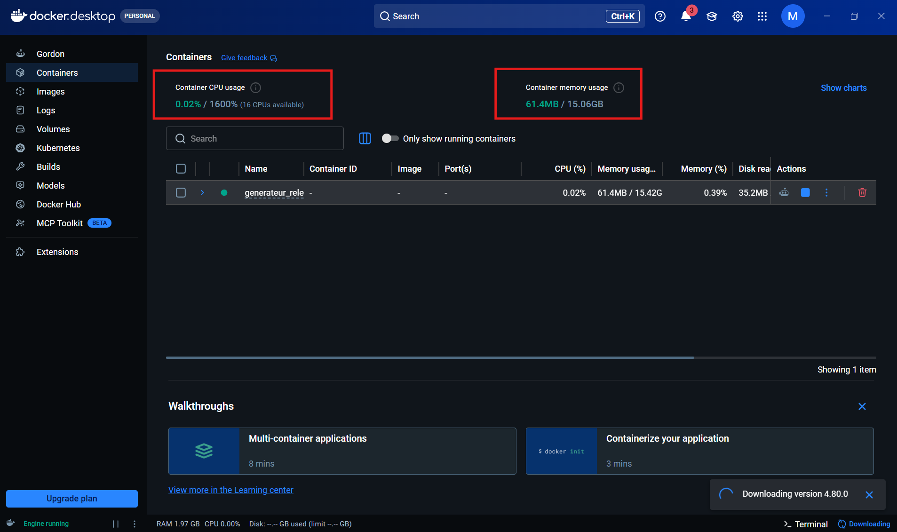

# Générateur de relevés de notes

Ce programme crée automatiquement les relevés de notes et les attestations
de réussite des étudiants, à partir du PV de délibération (le fichier Excel
avec toutes les notes). Plus besoin de les remplir un par un à la main.

## Ce qu'il vous faut avant de commencer

- Un ordinateur Windows.
- Le PV de délibération (fichier Excel).
- (Optionnel) Microsoft Excel installé, si vous voulez aussi des PDF prêts
  à imprimer.

## Installation (à faire une seule fois)

Ouvrez le menu Démarrer, tapez **PowerShell**, ouvrez-le, puis
copiez-collez cette ligne et appuyez sur Entrée :

```powershell
irm https://raw.githubusercontent.com/modhafferraihane/Generateur_releves_de_notes/main/install.ps1 | iex
```

C'est tout : le programme s'installe tout seul (y compris Python si besoin)
et se lance dans votre navigateur à la fin. Une icône **"Generateur de
releves de notes"** est créée sur le Bureau pour le relancer plus tard.

> Acceptez toute demande d'autorisation Windows. L'installation peut
> prendre quelques minutes la première fois.

## Utilisation

1. Double-cliquez sur l'icône du Bureau (ou relancez la commande
   d'installation ci-dessus).
2. Le site s'ouvre sur **http://127.0.0.1:5000**.
3. Choisissez la filière, puis le niveau.
4. Déposez le PV de délibération (et le fichier des coordonnées des
   étudiants si vous l'avez, pour compléter date de naissance et CIN).
5. Cochez "Générer aussi les PDF" si besoin.
6. Cliquez sur "Générer les relevés", puis téléchargez les fichiers (un par
   un ou tous d'un coup via "Télécharger tout (ZIP)").

Pour arrêter : fermez la fenêtre noire ouverte avec le programme.

## À savoir

- La mention du jury (Admis, Assez Bien...) n'est pas remplie
  automatiquement : à ajouter vous-même après génération.
- Date de naissance et CIN ne sont remplis que si le fichier des
  coordonnées des étudiants est fourni.

## En cas de problème

- **Erreur à la première installation** : fermez PowerShell, rouvrez-le, et
  relancez la commande une deuxième fois (Python a parfois besoin d'un
  redémarrage pour être détecté juste après son installation).
- **L'export PDF échoue** : fermez toute fenêtre Excel avec un message en
  attente, puis réessayez.

## Autre façon d'installer : avec Docker

Alternative utile sur Mac/Linux, ou pour ne pas installer Python
directement sur votre ordinateur. Le conteneur consomme très peu de
ressources, comme on le voit dans Docker Desktop :



> ⚠️ Avec Docker, l'export PDF ne fonctionne pas (il nécessite Excel sur
> Windows) : utilisez l'installation classique ci-dessus si vous en avez
> besoin.

Il vous faut [Docker Desktop](https://docs.docker.com/desktop/setup/install/windows-install/)
installé et lancé, ainsi que le fichier modèle de votre établissement
(`Exemple ... .xlsx`, et `AR ... .docx` si vous en avez un).

1. Dans un dossier de votre choix, créez un sous-dossier **modeles** et
   mettez-y votre fichier modèle.
2. Ouvrez un terminal (PowerShell recommandé) dans ce dossier et lancez :

   ```
   docker run -d --name generateur-releves -p 127.0.0.1:5000:5000 -v ./modeles://app/modeles:ro modovar/generateur-releves:1.0
   ```

   > Le double `//` avant `app/modeles` est volontaire (bug connu de Git
   > Bash sinon).

3. Ouvrez **http://127.0.0.1:5000** — un badge **🐳 Docker** confirme que
   c'est bien cette version qui tourne.

Pour arrêter/relancer : `docker stop generateur-releves` /
`docker start generateur-releves`. Si vous mettez à jour le fichier
modèle, faites `docker restart generateur-releves`.

Vos fichiers générés ne sont pas conservés ailleurs : téléchargez-les tout
de suite. Supprimer le conteneur (`docker rm`) efface tout, volontairement,
pour ne garder aucune donnée d'étudiant.
